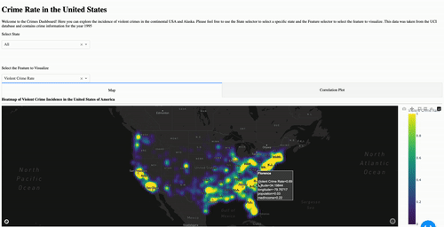
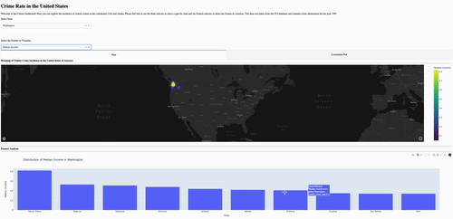
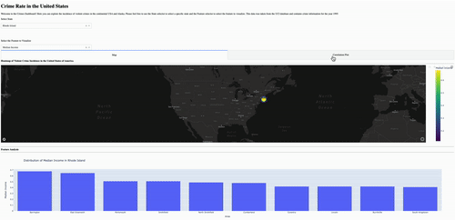

# Crime does not pay

Link to live dashboard: <https://crime-does-not-pay.onrender.com/>

## Motivation

Crime is a matter that affects everyone, and can have serious repercussions on how a community develops and interacts. What causes crime and how a community responds is a very controversial topic rife with misinformation and assumptions. That is why I aimed to create a visualization dashboard to allow everybody to explore a few important features and crime statistics collected by the FBI's UCR division in the year 1995. In this dashboard I aspire to give insight into how violent crime can be related to income, population, poverty and unemployment. These features appear in almost every crime report and I hope that by exploring this small dataset people can reflect on how these features change among different communities in the United States of America.

You can find our original proposal [here](https://github.com/UBC-MDS/Communites_and_Crime_group8/blob/main/reports/proposal.md)

## Description of the Dashboard

This is an interactive visualization tool that reacts to the user's selections in the dropboxes.

The landing page consists of a Heat Map that shows the selected feature (by default Violent Crime Rate) by State (or by default All the Continental US and Alaska)

## How to run this App

This dashboard is simple and intuitive. In the top portion you can find the two main filters: State and Features.

It also contains a Tab Navigator where you can choose to visualize a Heat Map or a Correlation Plot in the first half of the dashboard, and a permanent Bar Chart at the bottom.

Both filters do not change even if you change tabs!

-   As seen in the following animations States control the specific state to show in the Map, Bar Chart and Correlation Plot.

-   The main purpose of the Map is to show the accumulation of the feature selected and how some states can become hotspots.

-   We can combine States and Features to visualize more detailed information in the Map and Bar Chart.

-   And finally here we can see a Correlation Plot showing how strong a feature is correlated to another.

### Requirements

-   Python 3.10 or newer

Clone the repository into a directory of your choosing

    git clone https://github.com/DMerigo/Crime-does-not-pay

Navigate to that directory

    cd <directory address>

Create a virtual environment

    python3 -m virtualenv venv

Install the required versions using requirements.txt

    pip install -r requirements.txt

Run the app locally

    python app.py

A browser window should open soon with the dashboard

## Contributing

Interested in contributing? Check out the contributing guidelines [here](https://github.com/DMerigo/Crime-does-not-pay/blob/main/CONTRIBUTING). We would love to know what other datasets we can bring into our dashboard to make it more useful. Please also feel free to offer suggestions on other interactive options you'd like to see. Please note that this project is released with a [Code of Conduct](https://github.com/DMerigo/Crime-does-not-pay/blob/main/CODE_OF_CONDUCT). By contributing to this project, you agree to abide by its terms.

## License

This dashboard was created by Daniel Merigo This dashboard is licensed under the MIT license as explained [here](https://github.com/DMerigo/Crime-does-not-pay/blob/main/LICENSE)

## Reference

This dataset is a cleaned version of the FBI UCR databse from 1995, you can find the latest release [here](https://ucr.fbi.gov/crime-in-the-u.s).
